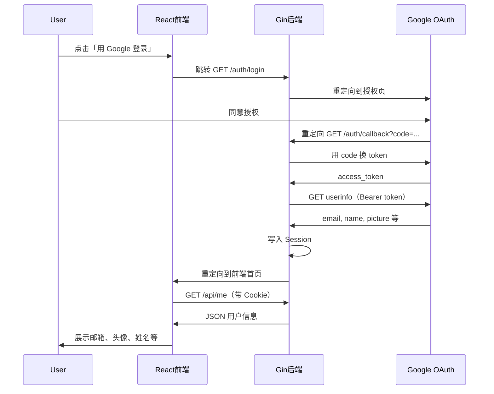
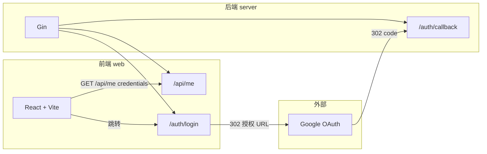

# Google OAuth Demo

基于 Gin（后端）+ React（前端）的 Google OAuth 2.0 登录 Demo，使用 Session + CORS 实现前后端分离。

## 架构与数据流

## 项目结构

## 目录说明

| 目录 | 技术栈 | 说明 |
|------|--------|------|
| `server/` | Go + Gin + godotenv + oauth2 | 提供 `/auth/login`、`/auth/callback`、`/api/me`，Session 存用户信息 |
| `web/` | React + Vite | 首页拉取 `/api/me` 展示用户信息，未登录时跳转后端登录 |

## 运行方式

- **后端**：`cd server && go run .`（默认 `:8081`，需配置 `.env` 中的 `GOOGLE_CLIENT_SECRET`）
- **前端**：`cd web && npm install && npm run dev`（默认 `http://127.0.0.1:5173`）
- 使用 **http://127.0.0.1:5173** 访问前端，与后端重定向地址一致。
