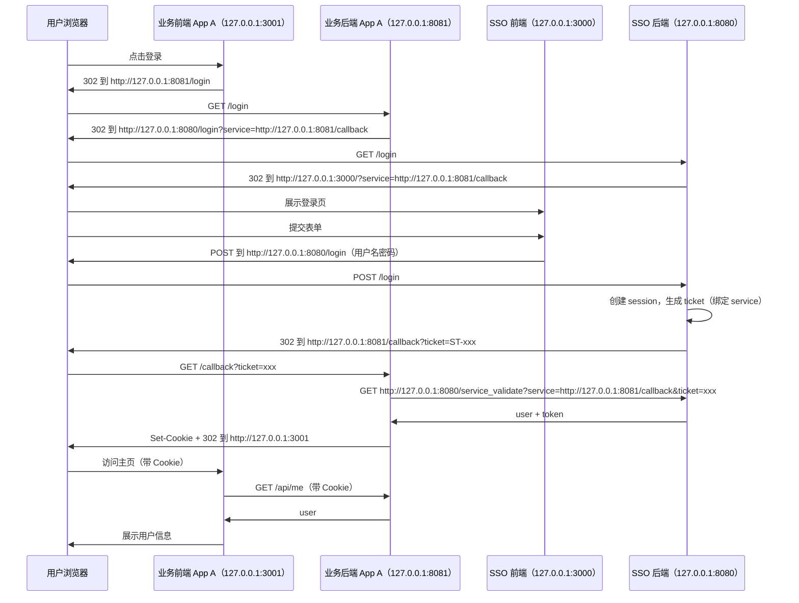
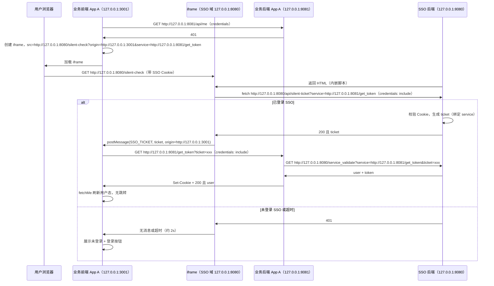
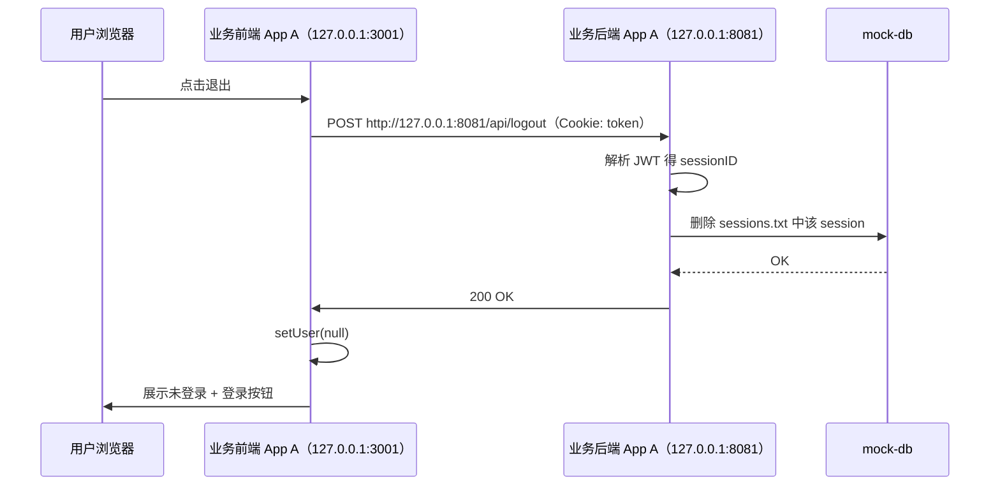

# SSO 单点登录 Demo（CAS + iframe 静默）

基于 CAS（Central Authentication Service）协议的单点登录 Demo：Golang 后端 + React 前端，JWT 作为 Token，Session 与用户数据放在 **mock-db** 目录下文件存储。

- **点击登录**：业务后端提供 `GET /login`、`GET /callback`。用户点击登录后 302 到 SSO，登录成功后 SSO 302 到业务 **AppA/callback** 或 **AppB/callback** 并携带 ticket，业务用 ticket 向 SSO 校验（service 为 callback URL）并写 Cookie。
- **静默登录**：页面刷新时若未登录，前端内嵌 iframe 加载 SSO `/silent-check`，传 **service=业务 get_token 的完整 URL**（如 AppB/get_token）。若浏览器已带 SSO session，iframe 内请求 `/api/silent-ticket` 拿到 ticket，经 `postMessage` 传给父页面，父页面请求业务 `GET /get_token?ticket=xxx`，业务用 ticket 向 SSO 校验（service 为 get_token URL）并写 Cookie，无跳转完成登录。
- **登出**：前端调业务 `POST /api/logout`，后端从 Cookie 解析 sessionID 并删除全局 session，前端清空用户态。

## 流程说明

### 参数说明（origin 与 service）

- **service**（CAS 协议）  
  - 业务侧用于**接收 ticket 或校验 ticket** 的后端 URL。  
  - **重定向登录**：由业务后端在 302 到 SSO 时传入，值为**业务 callback 的完整 URL**（如 `http://127.0.0.1:8081/callback`）；SSO 登录成功后 302 到该 URL 并带 `ticket`；业务后端在 `service_validate` 时必须用**同一 URL** 作为 `service` 参数，ticket 与该 URL 绑定，防止 ticket 被其他站点使用。  
  - **静默登录**：由业务前端在打开 iframe 时传入，值为**业务 get_token 的完整 URL**（如 `http://127.0.0.1:8081/get_token`）；SSO 签发 ticket 时绑定该 URL；业务后端调用 `service_validate` 时同样必须传该 URL。  

- **origin**（仅静默登录）  
  - 业务**前端**的 origin（如 `http://127.0.0.1:3001`），在打开 SSO 的 `/silent-check` iframe 时通过查询参数传入。  
  - SSO 返回的 silent-check 页面内脚本用 `postMessage(ticket, origin)` 把 ticket 发给父窗口；`postMessage` 的第二个参数限定只有该 origin 的窗口能收到，避免恶意站点通过嵌套 iframe 窃取 ticket。


### 登录流程时序图（重定向）

用户点击业务站「登录」后，跳转业务后端 `/login`，由后端 302 到 SSO 后端，未登录时再 302 到 SSO 前端登录页；用户提交表单到 SSO 后端，登录成功后 SSO 后端 302 到业务 **App A** 的 callback，业务用 ticket 向 SSO 后端换取 JWT（service 为 callback URL）并写 Cookie，再 302 回前端首页。下图以 **App A**（前端 127.0.0.1:3001、后端 127.0.0.1:8081）为例。




### 静默登录（iframe）流程时序图

当业务前端需要「无跳转」登录时（例如页面刷新且 `/api/me` 返回 401），会先请求 `/api/me`，若 401 则内嵌 iframe 加载 **SSO 后端**的 `/silent-check`（传 **origin**= 业务前端 origin、**service**= 业务 get_token 完整 URL）。若浏览器已携带 SSO session Cookie，iframe 内脚本请求 SSO 后端 `/api/silent-ticket?service=...` 拿到 ticket，通过 `postMessage(..., origin)` 传给父页面，父页面再调业务 `GET /get_token?ticket=xxx`，业务后端用同一 service 向 SSO 后端校验 ticket 并写 Cookie，无跳转完成登录。超时约 2 秒则展示「未登录」。下图以 **App A**（前端 127.0.0.1:3001、后端 127.0.0.1:8081）为例。




### 登出流程时序图

用户点击「退出」，业务前端带 Cookie 请求业务后端 `POST /api/logout`，后端从 Cookie 解析 sessionID 并删除全局 session（mock-db），返回 200；前端清空用户态展示「未登录」。**登出仅在本站清除 session，不调用 SSO 接口。**下图以 **App A** 为例。



## 端口与访问方式

使用 **IP + 端口**，无需配置 hosts：

| 服务    | 前端             | 后端             |
| ----- | -------------- | -------------- |
| SSO   | 127.0.0.1:3000 | 127.0.0.1:8080 |
| App A | 127.0.0.1:3001 | 127.0.0.1:8081 |
| App B | 127.0.0.1:3002 | 127.0.0.1:8082 |

## 后端服务接口说明

以下为 `sso/server` 中 SSO 后端与业务后端（App A / App B）暴露的 HTTP 接口，按服务与路径列出。业务后端 App A 与 App B 接口一致，仅端口与 Cookie 名不同（App A 默认 `token_a`，App B 默认 `token_b`）。

### SSO 后端（默认 127.0.0.1:8080）

| 方法 | 路径 | 说明 |
|------|------|------|
| GET | `/login` | 重定向登录入口；需带 `service`（业务 callback 完整 URL） |
| POST | `/login` | 接收登录表单，校验通过后 302 到 `service?ticket=xxx` |
| GET | `/service_validate` | 业务后端用 ticket 换取用户信息与 JWT |
| GET | `/silent-check` | 静默登录用，返回内嵌脚本的 HTML，脚本会请求 `/api/silent-ticket` 并通过 postMessage 回传 ticket |
| GET | `/api/silent-ticket` | 若浏览器带 SSO session Cookie，签发绑定到 `service` 的 ticket（JSON） |
| GET | `/api/silent-info` | 若带 SSO session Cookie，直接返回当前用户与 JWT（JSON），不经过 ticket |
| GET | `/api/me` | 校验 JWT（Cookie `token` 或 Header `Authorization: Bearer <token>`），返回当前用户（JSON） |


### 业务后端 App A（默认 127.0.0.1:8081）/ App B（默认 127.0.0.1:8082）

| 方法 | 路径 | 说明 |
|------|------|------|
| GET | `/login` | 302 到 SSO 后端 `/login?service=<本机 callback URL>` |
| GET | `/callback` | 重定向登录回调；用 ticket 向 SSO 换取 JWT 并 Set-Cookie，再 302 到前端首页 |
| GET | `/get_token` | 静默登录；用 ticket 向 SSO 换取 JWT 并 Set-Cookie，返回 JSON |
| POST | `/api/logout` | 清除服务端 session 并返回 200，前端需自行清 Cookie/状态 |
| GET | `/api/me` | 校验本业务 Cookie 中的 JWT，返回当前用户（JSON） |


## 目录结构

```
sso/

├── server/              # 统一后端（单 go.mod，多二进制）
│   ├── go.mod
│   ├── .env.example     # SSO 配置示例
│   ├── mock-db/         # 共享数据目录（session、用户）
│   │   ├── users.txt    # 模拟用户
│   │   └── sessions.txt # SSO 写入，业务站读写
│   ├── internal/        # 公共包
│   │   ├── jwt/         # JWT 签发与解析
│   │   ├── session/     # 全局 session 存储（文件）
│   │   └── users/       # 用户加载与校验
│   └── cmd/
│       ├── sso/         # SSO 中心 → 二进制 sso（8080）
│       ├── app-a/       # 业务站 A → 二进制 app-a（8081）
│       └── app-b/       # 业务站 B → 二进制 app-b（8082）
├── web-sso/             # SSO 登录页（3000）
├── web-app-a/           # 业务站 A 前端（3001）
├── web-app-b/           # 业务站 B 前端（3002）
└── README.md
```

## 数据文件（mock-db）

- **users.txt**：模拟用户，每行 `username\tpassword\tname`，至少两行。
- **sessions.txt**：由 SSO 自动创建/追加，一行一条 session（sessionId\tuserId\texpireUnix）；业务站只读用于校验登录态。

## 启动步骤

1. **构建并配置 SSO**
  ```bash
   cd sso/server && go build -o sso ./cmd/sso && go build -o app-a ./cmd/app-a && go build -o app-b ./cmd/app-b
   cp .env.example .env
  ```
   按需修改 `.env`（如 `JWT_SECRET`、`MOCK_DB`、`ALLOWED_SERVICE_BASES`）。

2. **启动 SSO 后端**
  ```bash
   cd sso/server && ./sso
  ```

3. **启动 SSO 登录页**
  ```bash
   cd sso/web-sso && npm install && npm run dev
  ```

4. **启动业务站 A**
  ```bash
   cd sso/server && ./app-a
   cd sso/web-app-a && npm install && npm run dev
  ```

5. **启动业务站 B**
  ```bash
   cd sso/server && ./app-b
   cd sso/web-app-b && npm install && npm run dev
  ```
