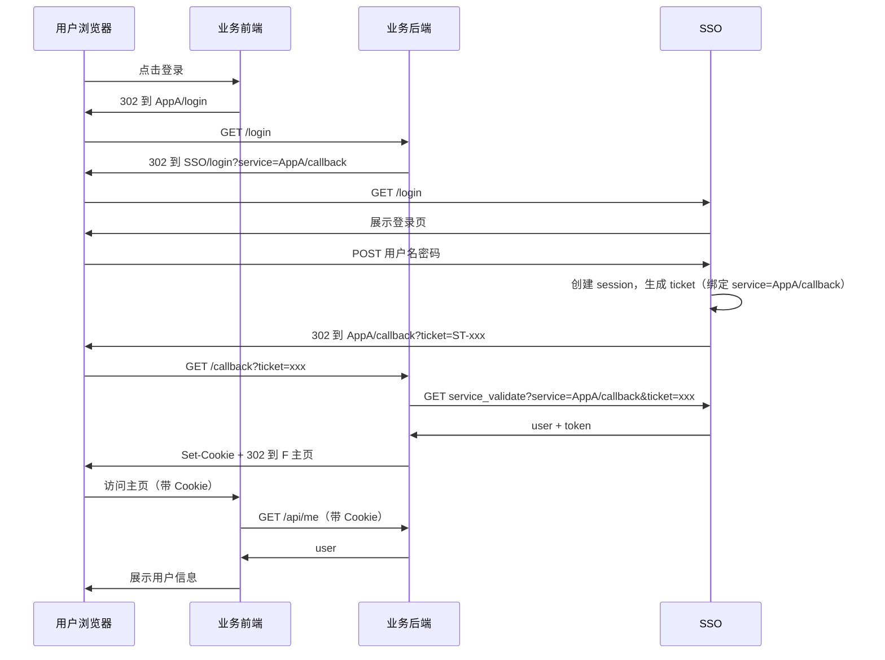
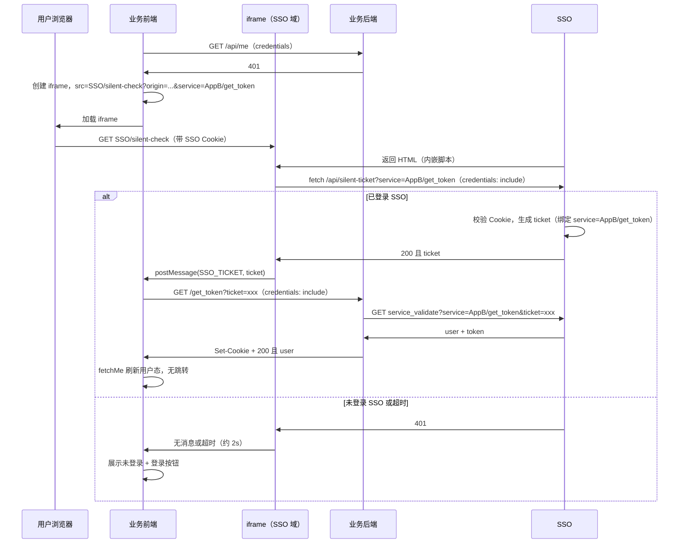
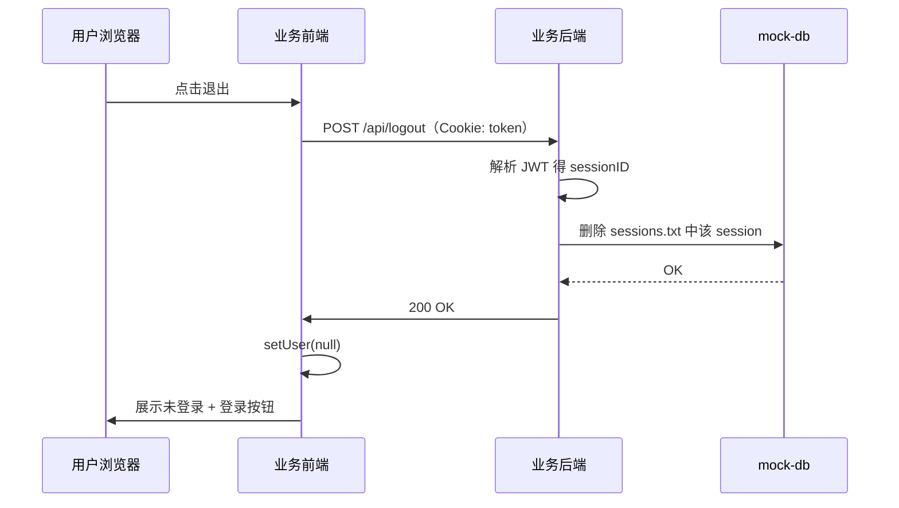

# SSO 单点登录 Demo（CAS + iframe 静默）

基于 CAS（Central Authentication Service）协议的单点登录 Demo：Golang 后端 + React 前端，JWT 作为 Token，Session 与用户数据放在 **mock-db** 目录下文件存储。

- **点击登录**：业务后端提供 `GET /login`、`GET /callback`。用户点击登录后 302 到 SSO，登录成功后 SSO 302 到业务 **AppA/callback** 或 **AppB/callback** 并携带 ticket，业务用 ticket 向 SSO 校验（service 为 callback URL）并写 Cookie。
- **静默登录**：页面刷新时若未登录，前端内嵌 iframe 加载 SSO `/silent-check`，传 **service=业务 get_token 的完整 URL**（如 AppB/get_token）。若浏览器已带 SSO session，iframe 内请求 `/api/silent-ticket` 拿到 ticket，经 `postMessage` 传给父页面，父页面请求业务 `GET /get_token?ticket=xxx`，业务用 ticket 向 SSO 校验（service 为 get_token URL）并写 Cookie，无跳转完成登录。
- **登出**：前端调业务 `POST /api/logout`，后端从 Cookie 解析 sessionID 并删除全局 session，前端清空用户态。

## 流程说明

### 登录流程时序图（重定向）

用户点击业务站「登录」后，跳转业务后端 `/login`，由后端 302 到 SSO，登录成功后 SSO 302 到业务 **AppA/callback** 或 **AppB/callback**，业务用 ticket 向 SSO 换取 JWT（service 为 callback URL）并写 Cookie，再 302 回前端首页。




### 静默登录（iframe）流程时序图

当业务前端需要「无跳转」登录时（例如页面刷新且 `/api/me` 返回 401），会先请求 `/api/me`，若 401 则内嵌 iframe 加载 SSO 的 `/silent-check`，**service 参数为业务 get_token 的完整 URL**（如 AppB/get_token）。若浏览器已携带 SSO session Cookie，iframe 内脚本请求 `/api/silent-ticket?service=AppB/get_token` 拿到 ticket（ticket 绑定到 get_token URL），通过 `postMessage` 传给父页面，父页面再调业务 `GET /get_token?ticket=xxx`，业务后端用 **service=AppB/get_token** 向 SSO 校验 ticket 并换取 JWT、写 Cookie，返回 200，前端无跳转即完成登录。超时约 2 秒则展示「未登录」。




### 登出流程时序图

用户点击「退出」，前端带 Cookie 请求业务后端 `POST /api/logout`，后端从 Cookie 解析 sessionID 并删除全局 session（mock-db），返回 200；前端清空用户态展示「未登录」。不调用 SSO 的 logout 接口。




## 端口与访问方式

使用 **IP + 端口**，无需配置 hosts：


| 服务    | 前端             | 后端             |
| ----- | -------------- | -------------- |
| SSO   | 127.0.0.1:3000 | 127.0.0.1:8080 |
| App A | 127.0.0.1:3001 | 127.0.0.1:8081 |
| App B | 127.0.0.1:3002 | 127.0.0.1:8082 |


## 目录结构

```
sso/

├── server/              # 统一后端（单 go.mod，多二进制）
│   ├── go.mod
│   ├── .env.example     # SSO 配置示例
│   ├── mock-db/         # 共享数据目录（session、用户）
│   │   ├── users.txt    # 模拟用户
│   │   └── sessions.txt # SSO 写入，业务站读写
│   ├── internal/        # 公共包
│   │   ├── jwt/         # JWT 签发与解析
│   │   ├── session/     # 全局 session 存储（文件）
│   │   └── users/       # 用户加载与校验
│   └── cmd/
│       ├── sso/         # SSO 中心 → 二进制 sso（8080）
│       ├── app-a/       # 业务站 A → 二进制 app-a（8081）
│       └── app-b/       # 业务站 B → 二进制 app-b（8082）
├── web-sso/             # SSO 登录页（3000）
├── web-app-a/           # 业务站 A 前端（3001）
├── web-app-b/           # 业务站 B 前端（3002）
└── README.md
```

## 数据文件（mock-db）

- **users.txt**：模拟用户，每行 `username\tpassword\tname`，至少两行。
- **sessions.txt**：由 SSO 自动创建/追加，一行一条 session（sessionId\tuserId\texpireUnix）；业务站只读用于校验登录态。

## 启动步骤

1. **构建并配置 SSO**
  ```bash
   cd sso/server && go build -o sso ./cmd/sso && go build -o app-a ./cmd/app-a && go build -o app-b ./cmd/app-b
   cp .env.example .env
  ```
   按需修改 `.env`（如 `JWT_SECRET`、`MOCK_DB`、`ALLOWED_SERVICE_BASES`）。
2. **启动 SSO 后端**
  ```bash
   cd sso/server && ./sso
  ```
   监听 8080，使用 `../mock-db`（或 `MOCK_DB` 指定路径）。
3. **启动 SSO 登录页**
  ```bash
   cd sso/web-sso && npm install && npm run dev
  ```
   访问 [http://127.0.0.1:3000](http://127.0.0.1:3000)
4. **启动业务站 A**
  ```bash
   cd sso/server && ./app-a
   cd sso/web-app-a && npm install && npm run dev
  ```
   业务站后端默认读 `../mock-db`（可设置环境变量 `MOCK_DB`、`JWT_SECRET` 等）。
5. **启动业务站 B**
  ```bash
   cd sso/server && ./app-b
   cd sso/web-app-b && npm install && npm run dev
  ```
