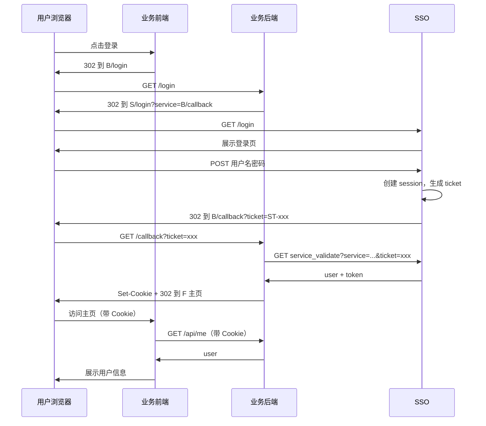
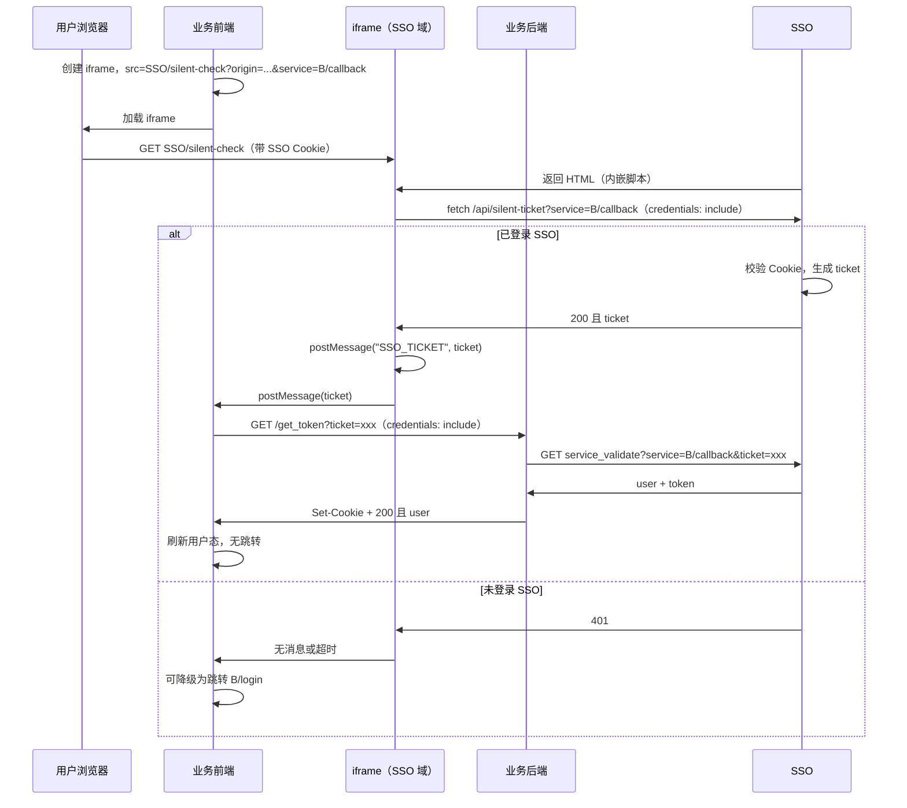
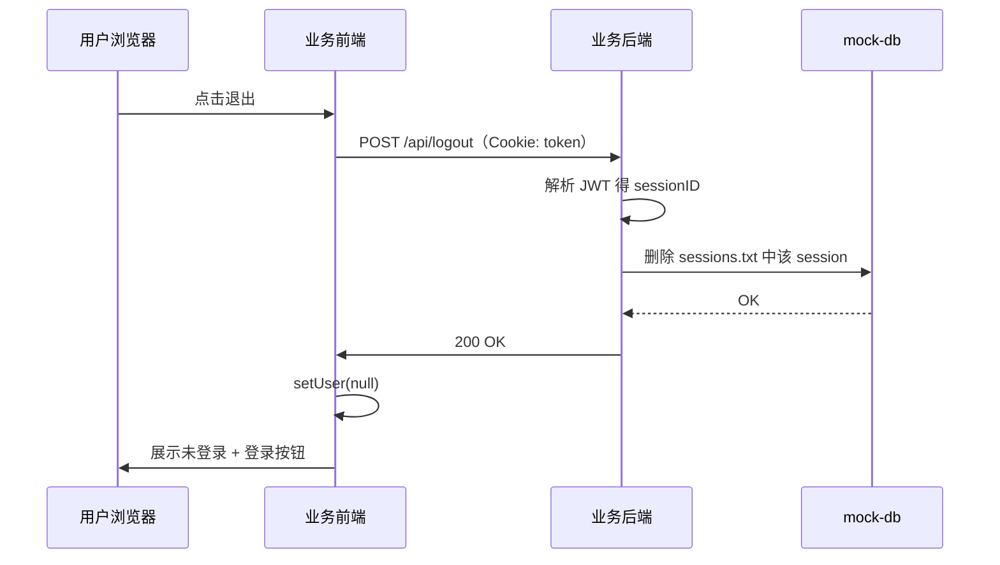

# SSO 单点登录 Demo（CAS + iframe 静默）

基于 CAS（Central Authentication Service）协议的单点登录 Demo：Golang 后端 + React 前端，JWT 作为 Token，Session 与用户数据放在 **mock-db** 目录下文件存储。业务后台提供 `/login` 与 `/callback`，登录由后端 302 到 SSO，SSO 回调业务 `/callback` 携带 ticket，业务用 ticket 向 SSO 校验并写 Cookie；支持 iframe 静默取 ticket 后调业务 `/get_token` 无跳转登录；登出由前端调业务 `POST /api/logout`（后端代调 SSO 并清 Cookie）。

## 架构概览

- **SSO 中心**：二进制 `server/sso`，维护全局 session，提供 `/login`、`/service_validate`、`/api/me`、`/silent-check`、`/api/silent-ticket` 等。登出由业务站删除全局 session。
- **业务站**：二进制 `server/app-a`、`server/app-b`，提供 `GET /login`、`GET /callback`、`GET /get_token`、`POST /api/logout`、`GET /api/me`。

## 端口与访问方式

使用 **IP + 端口**，无需配置 hosts：


| 服务    | 前端             | 后端             |
| ----- | -------------- | -------------- |
| SSO   | 127.0.0.1:3000 | 127.0.0.1:8080 |
| App A | 127.0.0.1:3001 | 127.0.0.1:8081 |
| App B | 127.0.0.1:3002 | 127.0.0.1:8082 |


## 目录结构

```
sso/

├── server/              # 统一后端（单 go.mod，多二进制）
│   ├── go.mod
│   ├── .env.example     # SSO 配置示例
│   ├── mock-db/         # 共享数据目录（session、用户）
│   │   ├── users.txt    # 模拟用户
│   │   └── sessions.txt # SSO 写入，业务站读写
│   ├── internal/        # 公共包
│   │   ├── jwt/         # JWT 签发与解析
│   │   ├── session/     # 全局 session 存储（文件）
│   │   └── users/       # 用户加载与校验
│   └── cmd/
│       ├── sso/         # SSO 中心 → 二进制 sso（8080）
│       ├── app-a/       # 业务站 A → 二进制 app-a（8081）
│       └── app-b/       # 业务站 B → 二进制 app-b（8082）
├── web-sso/             # SSO 登录页（3000）
├── web-app-a/           # 业务站 A 前端（3001）
├── web-app-b/           # 业务站 B 前端（3002）
└── README.md
```

## 数据文件（mock-db）

- **users.txt**：模拟用户，每行 `username\tpassword\tname`，至少两行。
- **sessions.txt**：由 SSO 自动创建/追加，一行一条 session（sessionId\tuserId\texpireUnix）；业务站只读用于校验登录态。

## 启动步骤

1. **构建并配置 SSO**
  ```bash
   cd sso/server && go build -o sso ./cmd/sso && go build -o app-a ./cmd/app-a && go build -o app-b ./cmd/app-b
   cp .env.example .env
  ```
   按需修改 `.env`（如 `JWT_SECRET`、`MOCK_DB`、`ALLOWED_SERVICE_BASES`）。
2. **启动 SSO 后端**
  ```bash
   cd sso/server && ./sso
  ```
   监听 8080，使用 `../mock-db`（或 `MOCK_DB` 指定路径）。
3. **启动 SSO 登录页**
  ```bash
   cd sso/web-sso && npm install && npm run dev
  ```
   访问 [http://127.0.0.1:3000](http://127.0.0.1:3000)
4. **启动业务站 A**
  ```bash
   cd sso/server && ./app-a
   cd sso/web-app-a && npm install && npm run dev
  ```
   业务站后端默认读 `../mock-db`（可设置环境变量 `MOCK_DB`、`JWT_SECRET` 等）。
5. **启动业务站 B**
  ```bash
   cd sso/server && ./app-b
   cd sso/web-app-b && npm install && npm run dev
  ```

## 流程说明

### 登录流程时序图

用户点击业务站「登录」后，跳转业务后端 `/login`，由后端 302 到 SSO，登录成功后 SSO 302 到业务 `/callback`，业务用 ticket 向 SSO 换取 JWT 并写 Cookie，再 302 回前端首页。




### 静默登录（iframe）流程时序图

当业务前端需要「无跳转」登录时（例如用户已在其他 Tab 登录过 SSO），可内嵌 iframe 加载 SSO 的 `/silent-check`。若浏览器已携带 SSO session Cookie，iframe 内脚本请求 `/api/silent-ticket` 拿到 ticket，通过 `postMessage` 传给父页面，父页面再调业务 `GET /get_token?ticket=xxx`，业务后端用 ticket 向 SSO 换取 JWT 并写 Cookie，返回 200，前端不跳转即完成登录。




### 登出流程时序图

用户点击「退出」，前端带 Cookie 请求业务后端 `POST /api/logout`，后端从 Cookie 解析 sessionID 并删除全局 session，返回 200；前端清空用户态展示「未登录」。




---

- **打开业务站主页**：请求本站 `/api/me`（后端直接读 mock-db 校验 JWT 与 session）；已登录则展示用户信息与退出按钮，未登录则展示「未登录」与登录按钮（不自动跳转）。
- **点击登录**：跳转本站 `GET /login`，后端 302 到 SSO 登录页，登录后 SSO 302 到本站 `/callback?ticket=xxx`，后端校验 ticket、写 Cookie、302 回前端首页。
- **静默登录（iframe）**：前端可内嵌 iframe 加载 `SSO/silent-check?origin=前端 origin&service=业务 callback URL`；若浏览器已带 SSO session Cookie，iframe 内会请求 `/api/silent-ticket` 拿到 ticket，通过 `postMessage({ type: 'SSO_TICKET', ticket })` 传给父页面；父页面再请求本站 `GET /get_token?ticket=xxx`，后端用 ticket 向 SSO 换取 JWT 并写 Cookie、返回 200，前端无跳转即登录。当前 Demo 前端未启用该流程，仅提供「登录」按钮跳转。
- **退出**：前端请求本站 `POST /api/logout`（带 Cookie），业务后端从 Cookie 取 token、解析出 sessionID，在全局 session 存储（mock-db/sessions.txt）中删除该 session，返回 200；前端清空用户态。不调用 SSO，SSO 无 logout 接口。
- **Cookie 跨域携带**：生产环境可设置 `COOKIE_SAME_SITE=None`、`COOKIE_SECURE=true`（需 HTTPS）；本地开发默认 `SameSite=Lax`。
- **同 host 多业务站**：Cookie 按 (域名, 路径, 名称) 区分，**不含端口**。3001/3002 都访问 127.0.0.1 时，若都用同名 cookie（如 `token`），后登录的会覆盖先登录的。本 Demo 中 app-a 默认用 `token_a`、app-b 默认用 `token_b`，可通过 `COOKIE_NAME` 覆盖。

## 配置项

**π>server（SSO 与业务站共用 .env 或环境变量）**

SSO 进程（`./sso`）使用：


| 变量                    | 说明                                   |
| --------------------- | ------------------------------------ |
| JWT_SECRET            | JWT 签名密钥（与业务站一致）                     |
| MOCK_DB               | mock-db 目录路径，默认 ../mock-db           |
| SESSION_FILE_PATH     | 可选，覆盖 session 文件路径                   |
| USERS_FILE            | 可选，覆盖用户文件路径                          |
| SSO_ORIGIN            | SSO 后端地址                             |
| SSO_FRONTEND_URL      | SSO 登录页地址                            |
| ALLOWED_SERVICE_BASES | 允许的 service（业务 callback 完整 URL），逗号分隔 |


业务站（`./app-a` / `./app-b`）使用：


| 变量               | 说明                                                                                             |
| ---------------- | ---------------------------------------------------------------------------------------------- |
| MOCK_DB          | mock-db 目录路径，默认 ../mock-db                                                                     |
| JWT_SECRET       | 与 SSO 一致，用于校验 JWT                                                                              |
| FRONTEND_ORIGIN  | 前端首页地址，如 [http://127.0.0.1:3001（callback](http://127.0.0.1:3001（callback) 成功后 302 目标）          |
| BACKEND_ORIGIN   | 本业务后端地址，用于拼 callback URL，默认 [http://127.0.0.1:8081（app-b](http://127.0.0.1:8081（app-b) 为 8082） |
| SSO_ORIGIN       | SSO 后端地址，默认 [http://127.0.0.1:8080](http://127.0.0.1:8080)                                     |
| COOKIE_SAME_SITE | 可选，Lax（默认）或 None（跨站携带需 None）                                                                   |
| COOKIE_SECURE    | 可选，true 时 Cookie 仅 HTTPS 发送                                                                    |
| COOKIE_NAME      | 可选，Token Cookie 名称；未设置时 app-a 为 token_a、app-b 为 token_b（同 host 多应用时避免互相覆盖）           |


